# Chaos Organizer


<!-- ⚠️ Ссылку на бейдж AppVeyor нужно заменить на настоящую после подключения репозитория — см. раздел "Настройка AppVeyor" ниже. -->

Дипломный проект курса **«Продвинутый JavaScript в браузере»** (Нетология).

Chaos Organizer — веб-сервис в духе «Сохранённых сообщений» Telegram: чат-органайзер, в который можно отправлять заметки, ссылки и файлы, а бот помогает навести порядок в этом хаосе.

- 🌐 **Демо (фронтенд):** https://devlop12x-crypto.github.io/chaos-organizer/
- ⚙️ **Серверная часть:** https://github.com/devlop12x-crypto/chaos-organizer-backend (задеплоена на Render)

> ⚠️ Бесплатный тариф Render «засыпает» без трафика: первый запрос может обрабатываться до 60 секунд, пока сервер просыпается. Если при открытии демо видите статус «переподключение…» — подождите минуту и обновите страницу.

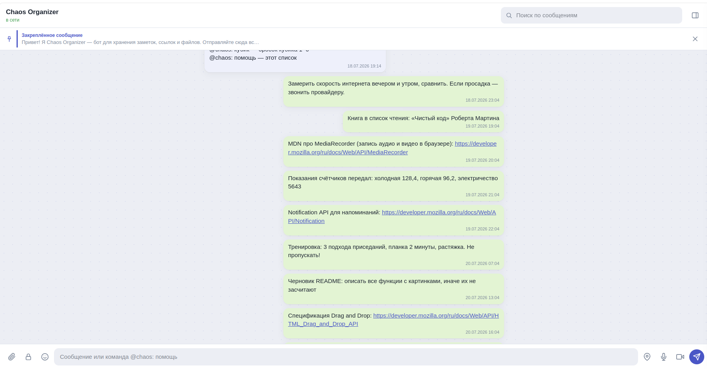

## Соответствие заданию

В задании упоминаются Heroku и AppVeyor. Heroku закрыл бесплатный тариф, поэтому сервер задеплоен на актуальный аналог — Render. **AppVeyor реализован буквально**, как и требует задание: конфигурация — `appveyor.yml` в каждом репозитории (Ubuntu-образ, `npm ci` → `npm run lint` → тесты → сборка). Он работает параллельно с GitHub Actions: GitHub Actions отвечает за деплой на GitHub Pages, AppVeyor — независимый второй CI-пайплайн, который проверяет сборку.

| В задании | В проекте |
|---|---|
| AppVeyor (CI) | **AppVeyor** (`appveyor.yml`) — реализован как требуется, плюс GitHub Actions для автодеплоя |
| Heroku (сервер) | **Render** (Web Service) — бесплатный тариф Heroku закрыт |
| Koa + ws на сервере | Koa (@koa/router, @koa/cors, koa-body) + ws |

## Обязательные функции

### 1. История ссылок и текстовых сообщений

Все сообщения сохраняются на сервере (в памяти процесса, по условию задания) и восстанавливаются при открытии приложения. При старте сервер наполняется демоданными, чтобы историю можно было проверить сразу.

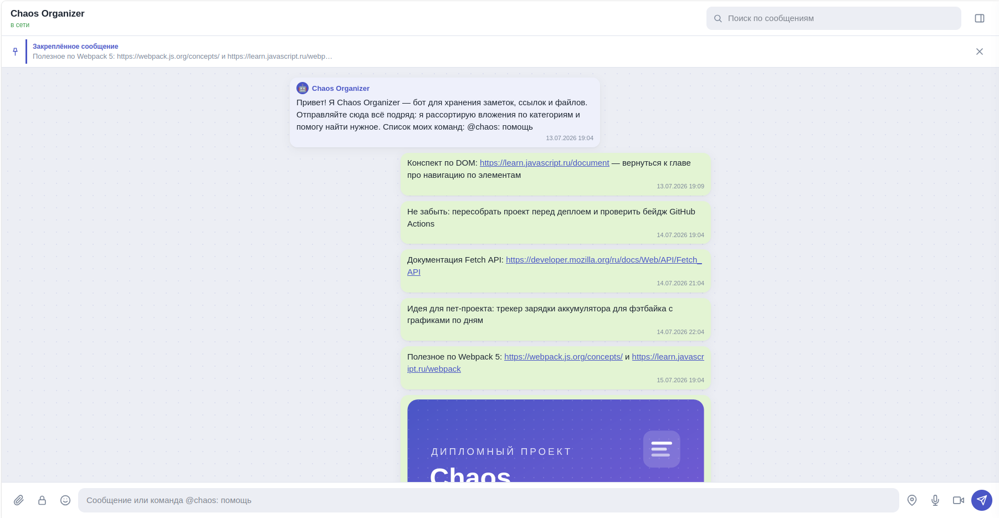

### 2. Кликабельные ссылки

Ссылки вида `http://` и `https://` внутри сообщений автоматически становятся кликабельными и открываются в новой вкладке. Весь текст при этом экранируется — вставка HTML в сообщение безопасна.

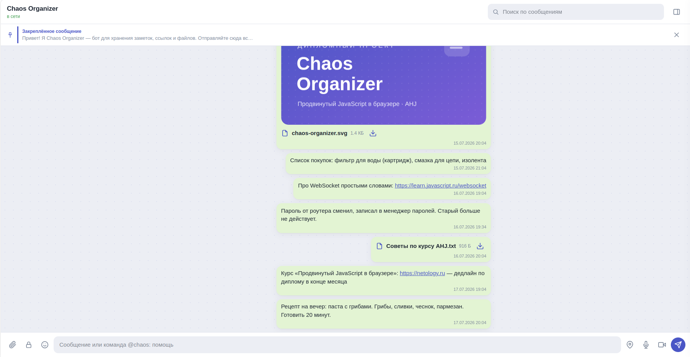

### 3. Отправка файлов: изображения, видео, аудио и другие

Файлы можно отправить двумя способами: **перетащить в окно чата (Drag & Drop)** — появится подсвеченная зона сброса, — или нажать **иконку-скрепку** и выбрать файлы в диалоге (поддерживается множественный выбор). Ограничение размера — 20 МБ на файл.

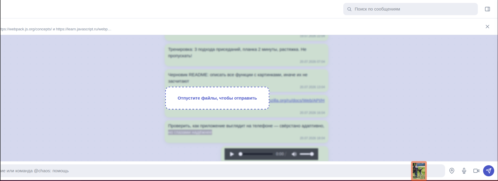

### 4. Скачивание файлов

У каждого файлового сообщения есть кнопка скачивания (иконка со стрелкой). Сервер отдаёт файл с заголовком `Content-Disposition: attachment`, кириллические имена передаются по RFC 5987 и сохраняются корректно.

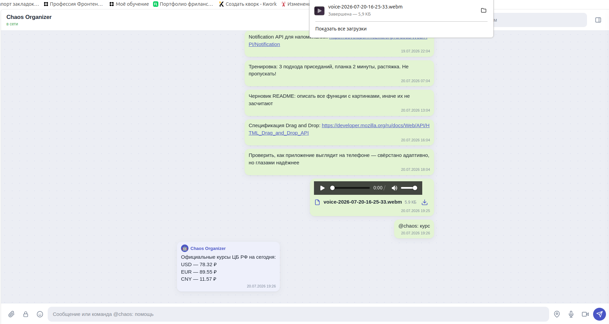

### 5. Ленивая подгрузка

При открытии загружаются **10 последних сообщений**. При прокрутке ленты вверх подгружаются следующие 10 и так далее — позиция прокрутки при этом сохраняется, лента не «прыгает».

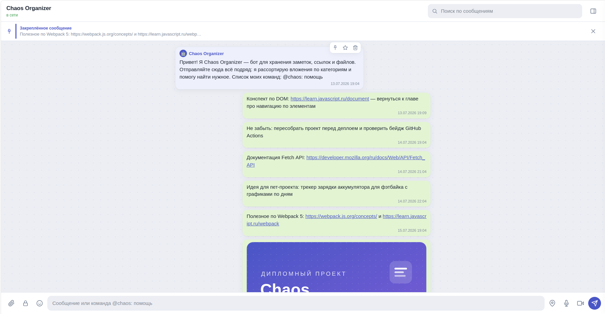

## Дополнительные функции (реализовано 9 + 2 сверху)

### 1. Синхронизация между вкладками

Все изменения (новые сообщения, закрепление, избранное) сервер рассылает по WebSocket всем подключённым клиентам. Откройте приложение в двух вкладках — сообщение, отправленное в одной, мгновенно появится во второй. При обрыве соединения клиент переподключается с растущей задержкой и догружает пропущенные сообщения.


### 2. Поиск по сообщениям

Строка поиска в шапке: запрос (от 2 символов) уходит **на сервер**, который ищет по тексту сообщений и именам файлов. Результаты показываются выпадающим списком с подсветкой совпадений; клик по результату прокручивает ленту к сообщению и подсвечивает его (при необходимости история докручивается автоматически).

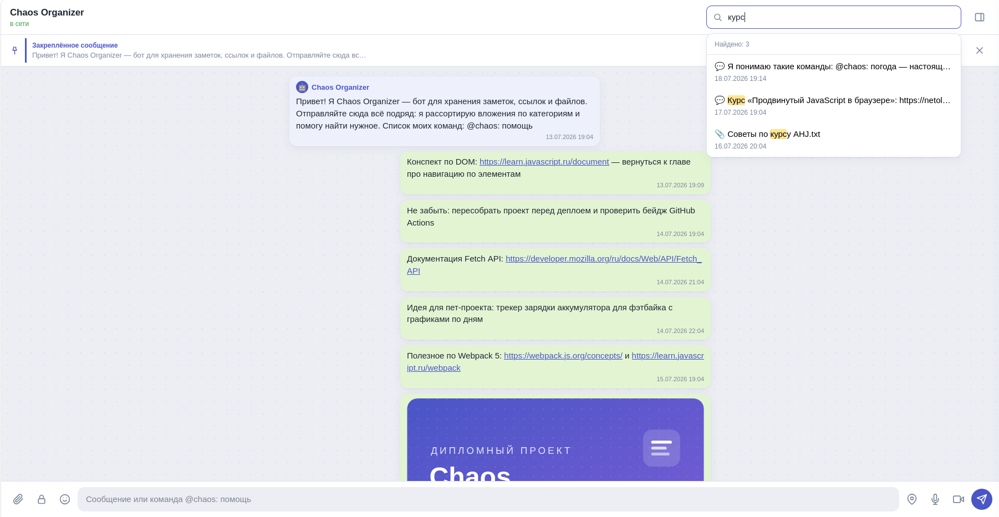

### 3. Запись аудио и видео

Кнопки 🎤 и 🎥 в панели ввода запускают запись через браузерные API (`getUserMedia` + `MediaRecorder`). Во время записи показывается таймер, для видео — живой предпросмотр с камеры. «Отправить» — запись загружается в чат как файл, «Отмена» — отбрасывается.


### 4. Отправка геолокации

Кнопка 📍 запрашивает координаты через Geolocation API и отправляет их сообщением. Координаты кликабельны — открывается карта OpenStreetMap с меткой. При запрете доступа показывается понятное сообщение об ошибке.

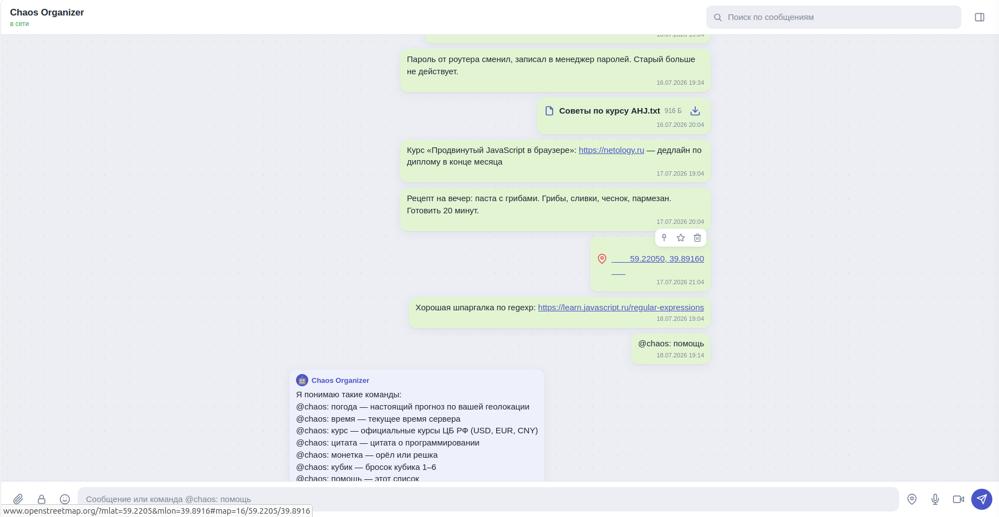

### 5. Воспроизведение видео и аудио

Аудио- и видеофайлы (в том числе записанные в приложении) проигрываются прямо в ленте встроенными плеерами браузера. Сервер поддерживает HTTP Range — работает перемотка.

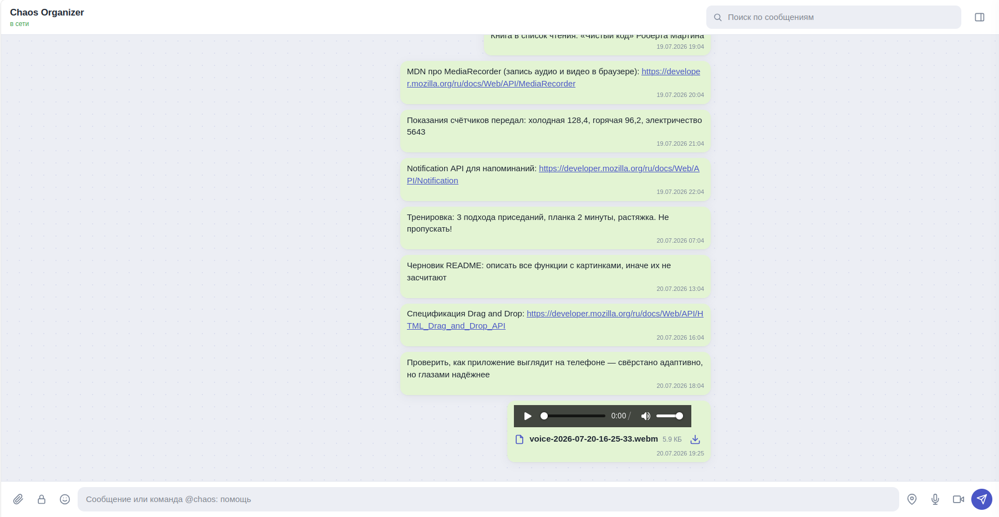

### 6. Команды боту

Сообщения вида `@chaos: команда` обрабатываются ботом на сервере: он показывает индикатор «печатает…» и отвечает. Доступно **7 команд**: `помощь`, `погода`, `время`, `курс`, `цитата`, `монетка`, `кубик`.

Две команды работают с **настоящими данными** — без сторонних библиотек и ключей, встроенным `fetch` (Node 18+):

- **`@chaos: погода`** — реальный прогноз по геолокации пользователя через бесплатный [Open-Meteo](https://open-meteo.com) (без регистрации и ключей). Перед отправкой команды браузер запрашивает у пользователя геолокацию, координаты прикладываются к команде; если доступ не дан — бот вежливо объясняет, как включить.
- **`@chaos: курс`** — официальные курсы ЦБ РФ (USD, EUR, CNY) через свободное зеркало данных Центробанка.

Если внешний сервис недоступен, бот честно отвечает «сервис сейчас недоступен» — сервер при этом продолжает работать (ошибки внешних запросов изолированы, таймаут 4 секунды). Остальные команды — развлекательные, со случайными ответами.

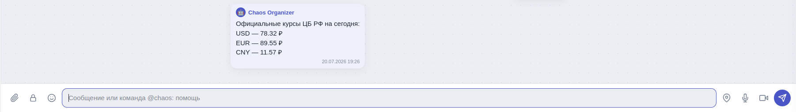

### 7. Закрепление сообщения

Наведите курсор на сообщение и нажмите иконку канцелярской кнопки — сообщение закрепится в плашке под шапкой. Закреплённым может быть **только одно** сообщение (новое закрепление снимает старое). Клик по плашке ведёт к сообщению, крестик открепляет.

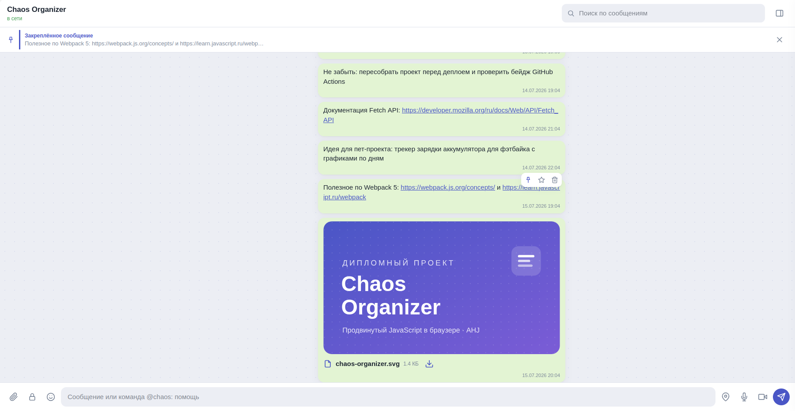

### 8. Избранные сообщения

Иконка звёздочки добавляет сообщение в избранное (и убирает из него). Все избранные собраны на вкладке «Избранное» в боковой панели; клик по элементу списка прокручивает ленту к сообщению.

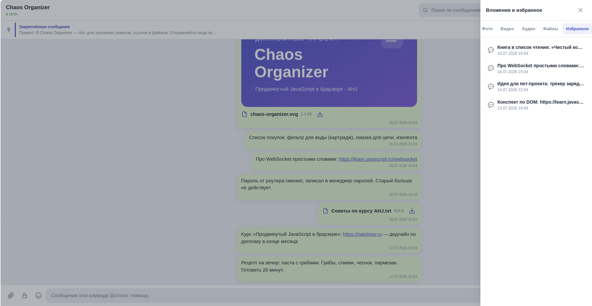

### 9. Вложения по категориям

Кнопка панели в шапке открывает боковую панель в духе Telegram: вкладки **Фото** (сетка превью), **Видео**, **Аудио**, **Файлы** — со списками вложений, размером, датой и кнопкой скачивания у каждого.

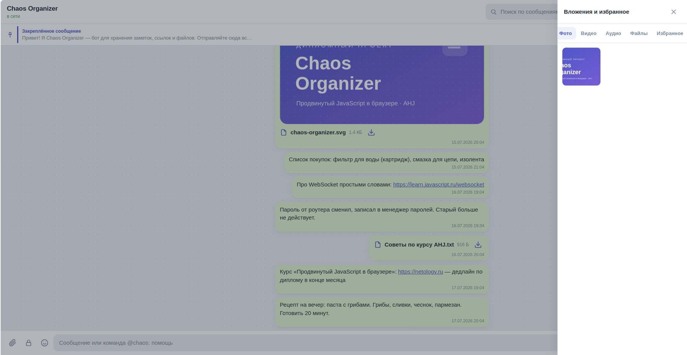

### 10. Шифрование сообщений и файлов (в ТЗ засчитывается за две функции)

Реализовано буквально по формулировке задания — *«отправка зашифрованных сообщений и файлов (привет crypto-js!) с просмотром расшифрованных (для этого нужно ввести пароль)»*. Кнопка-замок в панели ввода включает режим шифрования: приложение один раз запрашивает пароль и с этого момента **шифрует на клиенте** (AES, `crypto-js`) каждое отправленное сообщение и каждый файл — сервер получает и хранит только непрозрачный шифротекст, ключ на сервер никогда не уходит.

- Зашифрованное сообщение показывается в ленте плейсхолдером с иконкой замка и кнопкой «Показать» — при клике приложение спрашивает пароль и расшифровывает текст на месте.
- Зашифрованный файл показывается похожим плейсхолдером с кнопкой расшифровки: файл целиком скачивается как шифротекст, расшифровывается в браузере и после этого воспроизводится/скачивается как обычно (имя и тип файла для удобства и категоризации в сайдбаре передаются открытым текстом, шифруется только содержимое).
- Неверный пароль корректно отклоняется тостом с ошибкой, повторную попытку можно сделать сразу.
- Команды `@chaos:` внутри зашифрованных сообщений не распознаются ботом (сервер не видит текст — это ожидаемо и является частью модели безопасности).

**Осознанные ограничения схемы** (проговорено намеренно, а не упущено): деривация ключа из пароля в `crypto-js` — это устаревшая одно-проходная схема на базе MD5, без соли и итераций, поэтому короткий пароль подбирается быстрее, чем в современных KDF (Argon2id/PBKDF2). Само шифрование — обычный AES без проверки целостности (не AEAD): подмену шифротекста приложение не обнаружит, только неверный пароль (по факту нечитаемого результата). Для учебной демонстрации функции по ТЗ этого достаточно; как продакшен-грейд шифрование эту схему рассматривать не стоит. Это также **не end-to-end шифрование** в строгом смысле (как в секретных чатах Telegram/Signal) — там ключ согласуется между устройствами через Диффи-Хеллмана, а здесь общий пароль нужно передавать собеседнику отдельно, вне приложения.

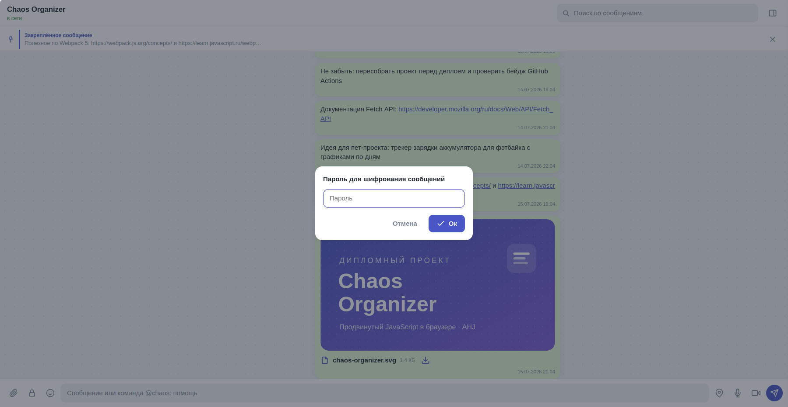


### 11. Пикер эмодзи

Кнопка со смайликом рядом с полем ввода открывает панель с набором эмодзи; клик вставляет символ в текущую позицию курсора, можно выбрать несколько подряд. Эмодзи — это обычные символы юникода, поэтому они одинаково хорошо работают и с обычными, и с зашифрованными сообщениями.

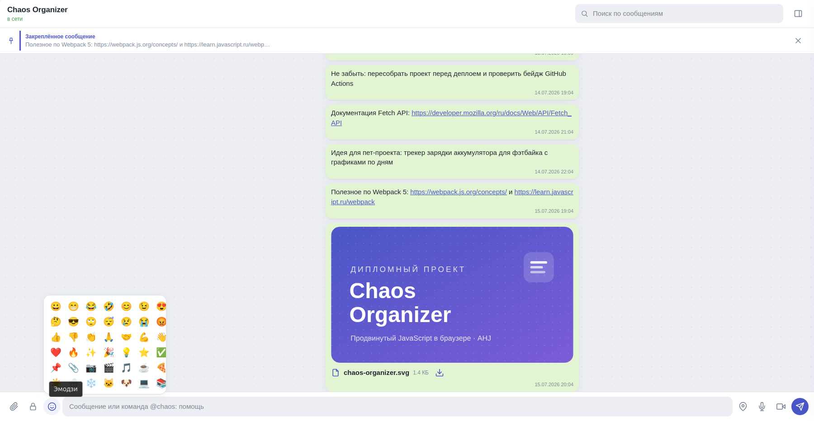

### 12. Удаление сообщений (сверх ТЗ)

В меню действий сообщения (появляется при наведении, рядом с «закрепить» и «в избранное») есть кнопка-корзина. Удаление необратимо, поэтому запрашивается подтверждение. Сообщение удаляется на сервере (файл вложения стирается с диска), исчезает из ленты во **всех открытых вкладках** через WebSocket; если удалено закреплённое сообщение — закрепление сбрасывается автоматически.

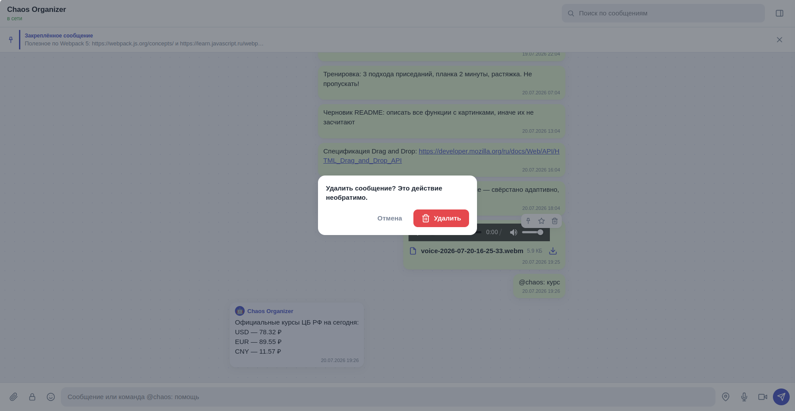

### 13. Расшифровка голосовых в текст (сверх ТЗ)

Во время записи аудио или видео приложение параллельно распознаёт речь через **нативный Web Speech API** (`SpeechRecognition`) — тот же класс встроенных браузерных API, что Geolocation/Notification/MediaRecorder: без сторонних библиотек, без ключей, бесплатно. В окне записи идут живые субтитры; при отправке стенограмма прикрепляется к голосовому сообщению и показывается под плеером. Бонус: стенограмма индексируется серверным поиском — **голосовые сообщения находятся по своему содержимому**, как в Telegram Premium.

Честные ограничения (следствие условий «бесплатно и без библиотек»):

- Расшифровка возможна **только в момент записи**: браузерный `SpeechRecognition` слушает исключительно микрофон и не принимает готовые аудиофайлы на вход. Загруженное со стороны аудио и старые голосовые расшифровать нельзя — это фундаментальное ограничение API, а не недоработка.
- Реальная поддержка: **настольные Chrome и Edge**. На **Android** распознавание одновременно с записью не работает — система отдаёт микрофон записи монопольно, и распознаватель получает тишину. В **Chromium-форках** (Opera, Brave, Mi Browser и т.п.) API формально существует, но неработоспособен: путь распознавания в Chromium завязан на ключи сервиса Google, которые поставляются только с официальным Chrome. В Firefox API отсутствует. Во всех этих случаях приложение показывает честную подсказку в окне записи, а голосовое отправляется без стенограммы — сама запись работает везде.
- В Chrome распознавание выполняет сервис браузера (аудио обрабатывается на серверах Google) — для разработчика и пользователя бесплатно и без регистрации, но требуется интернет.
- Зашифрованные голосовые сознательно уходят **без** стенограммы: открытый текст рядом с шифротекстом выдал бы содержимое записи (сервер дополнительно отбрасывает поле `transcript` у зашифрованных загрузок — защита в два уровня).

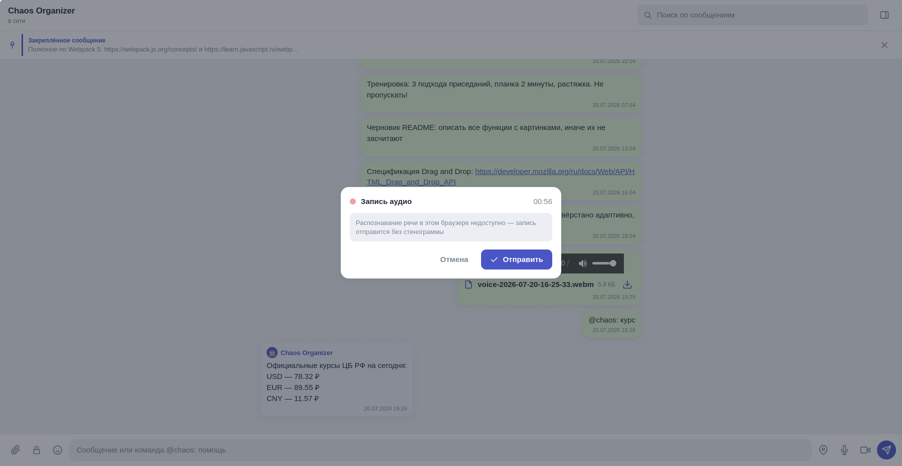

## Технологии

**Фронтенд:** JavaScript (ES2022, классы с приватными полями), Webpack 5, Babel (preset-env + core-js 3), ESLint (airbnb-base), Jest, современный DOM API (`append` / `prepend` / `before` / `closest` / `dataset`, `<template>`), CSS без фреймворков.

**Криптография:** AES (`crypto-js`) — реализация буквально по формулировке ТЗ, без апгрейдов до Argon2id/Web Crypto API. Осознанные упрощения схемы описаны в пункте 10 выше.

**Сервер:** Node.js 18+, Koa (@koa/router, @koa/cors, koa-body), ws. Данные — в памяти процесса, файлы — на диске.

**CI/CD:** GitHub Actions (lint → test → build → деплой в ветку `gh-pages`).

## Архитектура

Логика разбита на независимые модули; центральный класс-**оркестратор** `ChaosOrganizer` связывает их между собой — сами компоненты друг о друге не знают и общаются только через колбэки:

```
src/
├── index.js                  # точка входа
├── index.html                # разметка + SVG-спрайт иконок
├── css/style.css
└── js/
    ├── config.js             # адреса API (localhost / Render)
    ├── app/
    │   └── ChaosOrganizer.js # ОРКЕСТРАТОР — логическое ядро
    ├── api/
    │   ├── ApiClient.js      # REST-клиент (fetch)
    │   └── SocketClient.js   # WebSocket с автопереподключением
    ├── services/
    │   ├── MediaRecorderService.js  # запись аудио/видео
    │   ├── SpeechRecognitionService.js # живое распознавание речи (Web Speech API)
    │   ├── geolocation.js           # Geolocation API
    │   └── encryption.js            # AES-шифрование (crypto-js)
    ├── ui/                   # «глупые» представления
    │   ├── MessagesView.js   # лента: рендер, скролл, ленивая подгрузка
    │   ├── MessageRenderer.js# DOM одного сообщения
    │   ├── ComposerView.js   # панель ввода
    │   ├── PinnedBar.js      # плашка закреплённого
    │   ├── Sidebar.js        # категории вложений + избранное
    │   ├── SearchPanel.js    # поиск с подсветкой
    │   ├── RecorderModal.js  # окно записи
    │   ├── PasswordModal.js  # окно ввода пароля (шифрование/расшифровка)
    │   ├── ConfirmModal.js   # окно подтверждения (удаление)
    │   ├── EmojiPicker.js    # панель эмодзи
    │   ├── DropZone.js       # Drag & Drop
    │   └── Toast.js          # уведомления
    └── utils/
        ├── format.js         # экранирование, linkify, дата, размер
        └── format.test.js    # Jest-тесты
```

Поток данных: действие пользователя → REST-запрос → сервер рассылает событие по WebSocket → **все** вкладки (включая текущую) обновляют интерфейс. Дедупликация сообщений по `id` исключает дубли.

## Запуск локально

Понадобятся два терминала.

**1. Сервер** (порт 7070):

```bash
git clone https://github.com/devlop12x-crypto/chaos-organizer-backend.git
cd chaos-organizer-backend
npm install
npm run dev
```

**2. Фронтенд** (порт 8080):

```bash
git clone https://github.com/devlop12x-crypto/chaos-organizer.git
cd chaos-organizer
npm install
npm start
```

Приложение откроется на http://localhost:8080 и подключится к локальному серверу автоматически.

## Деплой

**Сервер (Render):**

1. Создайте Web Service из репозитория `chaos-organizer-backend`.
2. Build command: `npm install`, Start command: `npm start` (порт Render передаёт через `PORT`).
3. Скопируйте выданный URL вида `https://<имя>.onrender.com`.

**Фронтенд (GitHub Pages):**

1. Впишите URL сервера в константу `PRODUCTION_API` в `src/js/config.js`.
2. Запушьте в ветку `main` — GitHub Actions прогонит линтер, тесты и сборку и опубликует `dist` в ветку `gh-pages`.
3. В настройках репозитория: Settings → Pages → Source: ветка `gh-pages`.

## Настройка AppVeyor

Конфигурация `appveyor.yml` уже в репозитории — осталось один раз подключить сам репозиторий к аккаунту AppVeyor:

1. Зарегистрируйтесь на [appveyor.com](https://www.appveyor.com) через GitHub (бесплатно для open source — неограниченное число публичных репозиториев, 1 параллельная сборка).
2. New Project → выберите `chaos-organizer` (и отдельно `chaos-organizer-backend`) из списка репозиториев GitHub.
3. AppVeyor сам найдёт `appveyor.yml` в корне и запустит сборку при следующем пуше.
4. Settings → Badges → скопируйте markdown-ссылку на бейдж и замените плейсхолдер в начале этого README (сейчас там ссылка-заглушка с моим предполагаемым URL проекта — настоящую AppVeyor выдаст только после подключения).

## Известные особенности

- Данные хранятся в памяти сервера и на его диске — при перезапуске/редеплое пользовательский контент очищается, демоданные восстанавливаются (допущение из задания).
- Запись аудио/видео использует контейнер WebM — в Safari поддержка `MediaRecorder` ограничена, рекомендуется Chrome или Firefox.
- У записанного `MediaRecorder`-аудио нет метаданных длительности, поэтому плеер показывает её только после начала воспроизведения (известная особенность API).
- Пароль шифрования нигде не сохраняется — ни на сервере, ни в `localStorage`: он живёт только в памяти вкладки, пока включён режим шифрования, и обнуляется при перезагрузке страницы или повторном клике на замок. Забытый пароль означает безвозвратную потерю доступа к содержимому — это ожидаемое поведение, а не баг.
- Шифрование защищает содержимое от сервера и от постороннего наблюдателя, но не заменяет полноценный E2E-протокол с обменом ключами (см. пункт 10 выше) — пароль всё равно нужно передать собеседнику отдельным каналом.
- Погода и курсы валют берутся из внешних бесплатных сервисов (Open-Meteo и зеркало ЦБ РФ). Если сервис недоступен или сервер без интернета, бот отвечает «сервис сейчас недоступен» — это штатное поведение, а не ошибка приложения.
